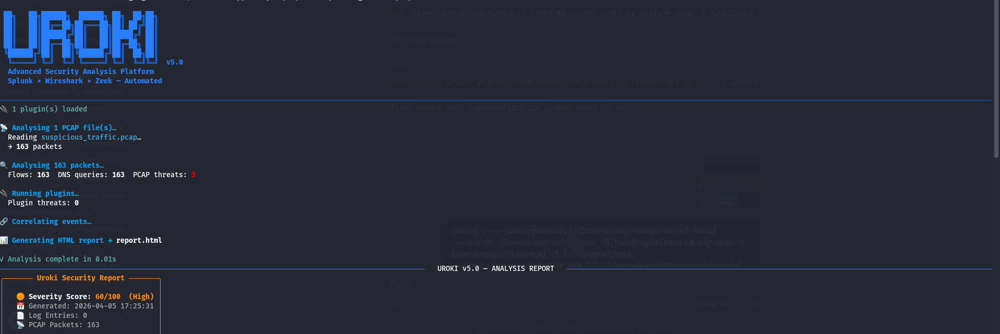
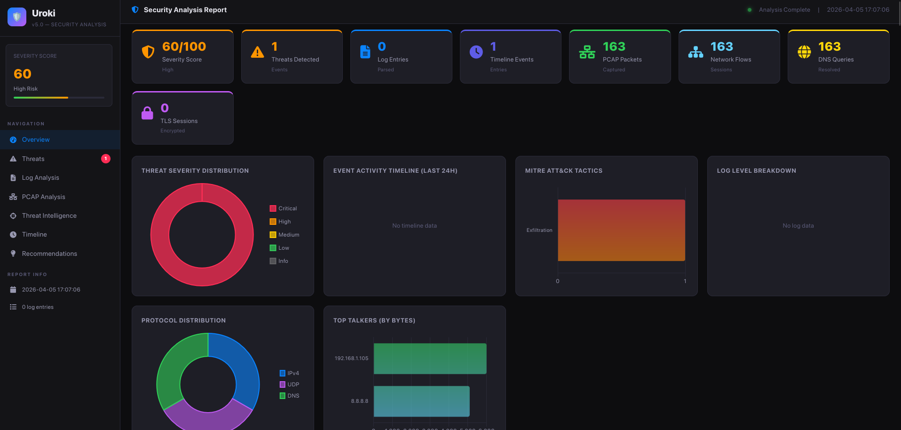
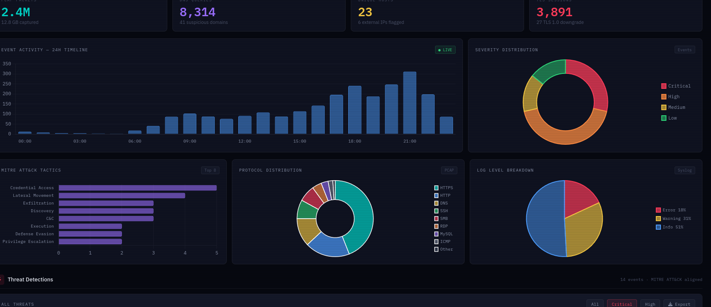
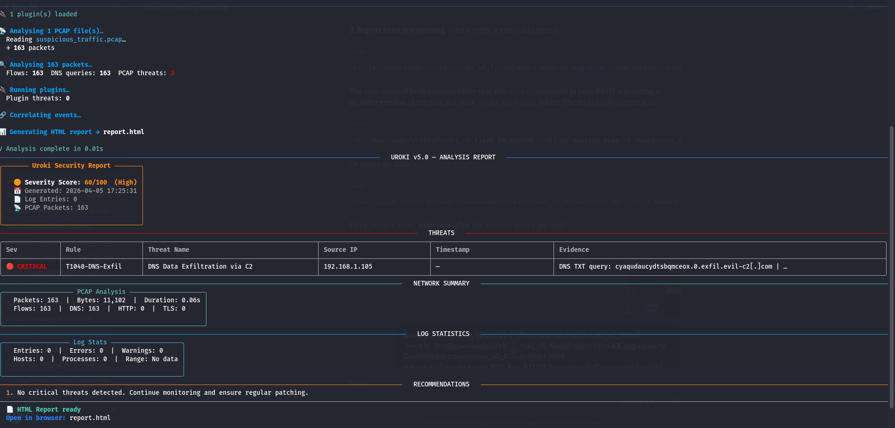
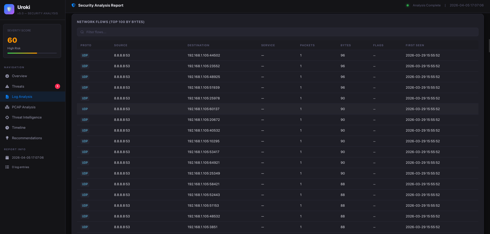
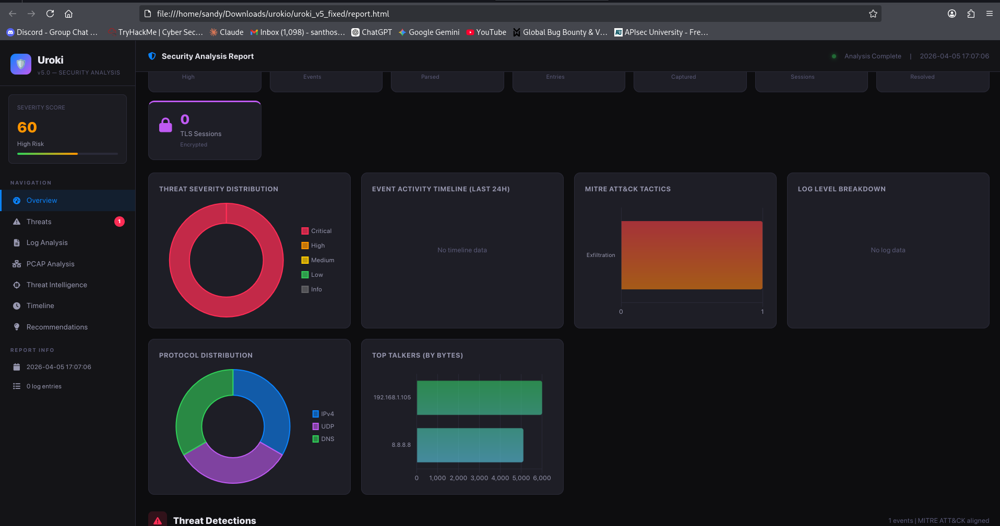

<p align="center">
  
</p>

<h1 align="center">🛡️ Uroki v5.0 — Advanced Security Analysis Platform</h1>

<p align="center">
  Automated PCAP + Log analysis with MITRE ATT&CK threat detection and an interactive HTML dashboard.<br/>
  <b>Splunk × Wireshark × Zeek — Automated</b>
</p>

---

##  Dashboard Preview

<p align="center">
  
</p>

<p align="center">
  
</p>

---

##  Threat Detection

<p align="center">
  
</p>

---

##  Network Flows

<p align="center">
  
</p>

---

##  Features

-  **PCAP Analysis** — DNS tunneling, data exfiltration, port scans, ARP spoofing
-  **Log Parsing** — access logs, auth logs, syslog, Apache, Nginx
-  **MITRE ATT&CK Aligned** — every threat mapped to a technique
-  **Interactive HTML Dashboard** — dark theme, charts, filterable tables
-  **Plugin Support** — extend with custom detection rules
-  **JSON Export** — machine-readable output for SIEM integration

---

##️ Requirements
```bash
pip install scapy rich
```

---

##  Usage

### Analyse PCAP only
```bash
python uroki.py analyze pcap -f capture.pcap -o report.html
```

### Analyse logs only
```bash
python uroki.py analyze logs -f access.log auth.log -o report.html
```

### Analyse PCAP + logs together
```bash
python uroki.py analyze all -f access.log suspicious_traffic.pcap -o report.html
```

### Export JSON report as well
```bash
python uroki.py analyze all -f access.log capture.pcap -o report.html --json
```

### Open the report
```bash
xdg-open report.html
```

---

##  Patching (Linux Raw IPv4 PCAP support)

If your PCAP uses link-type 228 (Linux raw IPv4), run the patcher first:
```bash
python patch_engine.py
```

Then run your analysis normally.

---

##  Project Structure

---

## ️ Report Output

<p align="center">
  
</p>

The report opens as a **standalone HTML file** — no server needed, works in any browser.

---

##  License

MIT License — see [LICENSE.md](LICENSE.md)

---

<p align="center">Made with ❤️ for the cybersecurity community</p>
